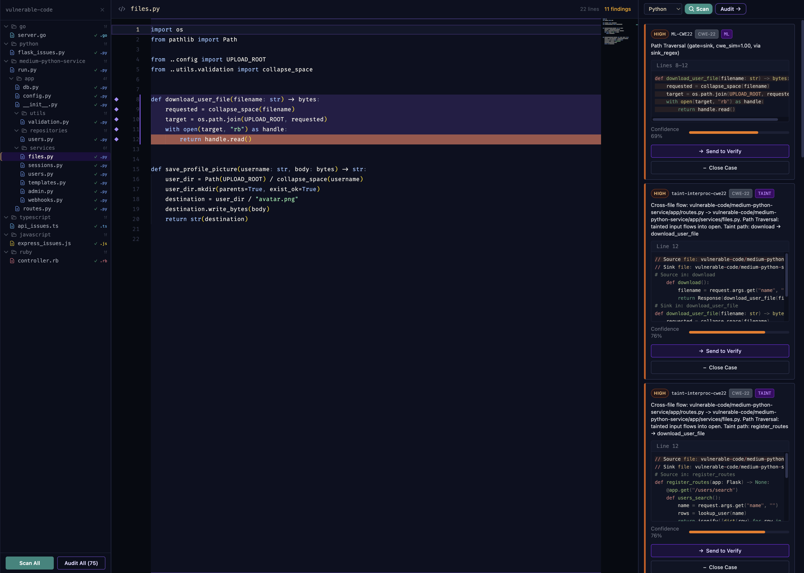
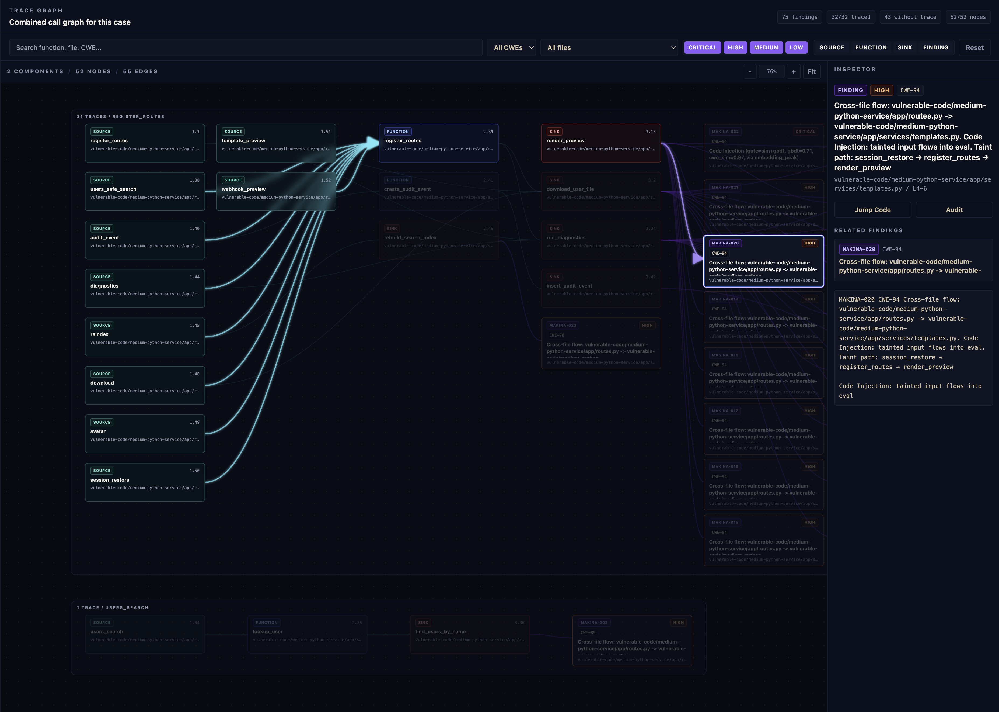
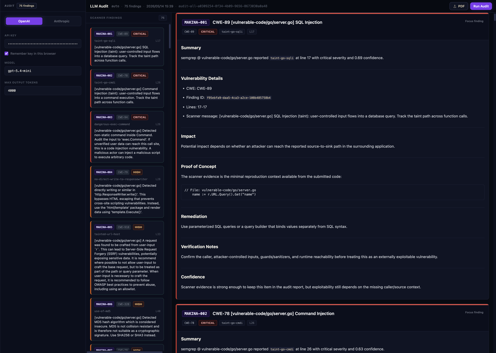
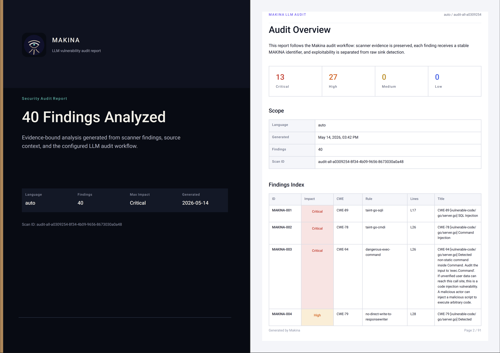
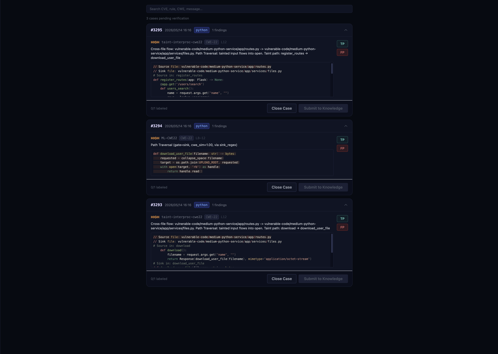
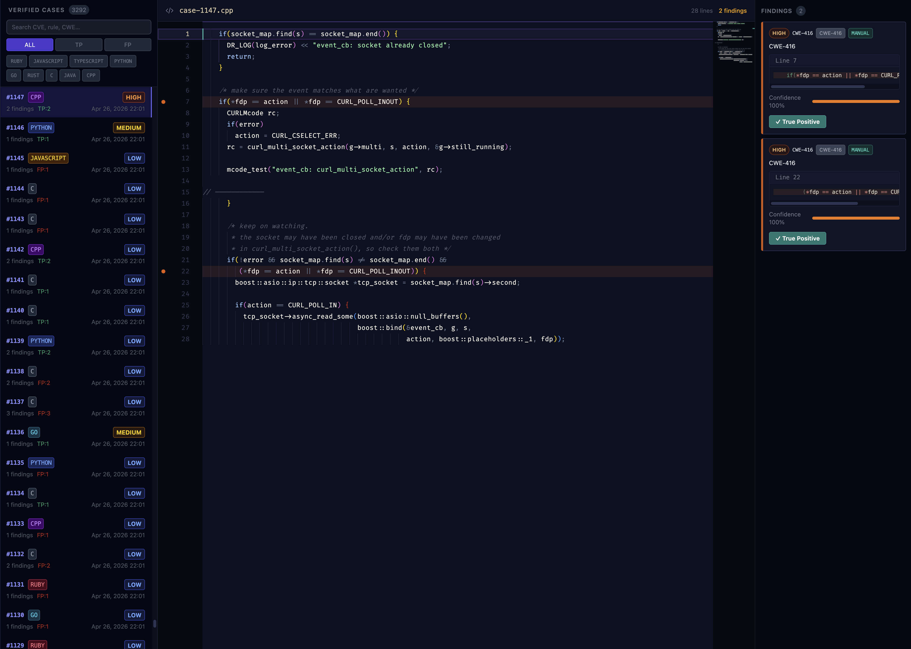
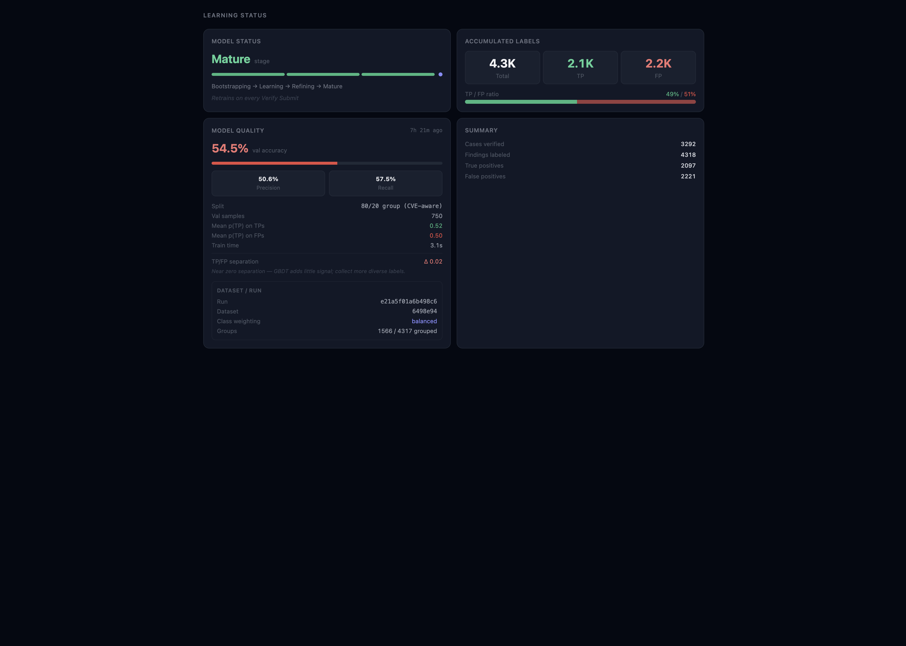

# makina: Pre-LLM Security Analysis Pipeline

makina prepares source-code security evidence before it is handed to an LLM.
It is built for strong static analysis: rule-based scanning, semantic matching,
taint tracing, structural checks, and call-graph context, with a continuously
learning confidence model that retrains from human Review labels.

## Demo

### Scan
-- analyzes pasted code or dropped folders and turns detector output into
deduplicated findings with line evidence, CWE metadata, and confidence scores.

### Trace
-- shows the call-graph evidence behind findings, linking sources,
functions, sinks, and reported issues in one inspectable workspace.

### Audit
-- sends bounded scanner evidence through backend-managed LLM workflows and
renders one structured MAKINA report block per finding.

### Audit PDF
-- exports the same structured report into a branded security report
format suitable for sharing or archival.

### Review
-- is the human triage queue. Findings are marked TP/FP or closed here,
and submitted decisions become training data.

### Knowledge
-- keeps reviewed and closed cases available for later inspection,
including source context, labels, and historical decisions.

### Model
-- shows the current learning state, accumulated labels, validation
metrics, and retraining status.

