# makina — Architecture

## Design Philosophy

makina is a security scanner that continuously self-learns from human verification.
The model updates on **every Verify Submit** — not at fixed thresholds.
Label count is a maturity indicator, not a capability gate.

### Code organisation: Hexagonal + Vertical Slice

The Rust core is laid out as **vertical slices over a hexagonal core**:

- **Vertical slice (`features/`)** — one module per user-visible feature
  (Scan, Verify, Knowledge, Model, plus the supporting `labels` and
  `findings` endpoints). Each slice owns its handler and stays free of
  unrelated concerns; new features land as new directories rather than
  edits to a god `handlers.rs`.
- **Hexagonal boundary (`infra/`)** — every byte of `reqwest` traffic to
  the Python ML service goes through `MlClient`. Feature handlers see
  domain types (`Finding`, `Language`) and never serialise wire
  formats themselves; this is the seam tests will swap.
- **Data layer (`store/`)** — SQLite reads/writes for the three
  databases. Functions are imported by handlers via `crate::store::*`.
- **Shared API contract (`api/`)** — `Router::new()` composition and
  request/response DTOs. No business logic.

The Python ML service follows the same shape on a smaller scale: thin
FastAPI handlers in `server.py` delegate to `services/` modules
(currently `training.py` for the GBDT pipeline) so the wire format stays
separate from the ML code path. The `analyzer.py`, `embedder.py`,
`taint_engine.py`, `property_patterns/`, etc. modules are the domain core
that services compose.

The frontend follows MVVM-ish separation: `lib/api.ts` is the network
boundary, `lib/types.ts` the shared contract, `lib/components/` the
view layer, and `+page.svelte` the page-level state coordinator.
Frontend test tooling stays on Vitest 3.x with Vite 6.x, and
`package.json` pins SvelteKit's transitive `cookie` dependency to
`0.7.2` via npm overrides so `npm audit --audit-level=low` remains
clean without changing the SvelteKit major line. Monaco is loaded from
the narrow `editor.api` ESM entry and split with Vite manual chunks so
the editor stays lazy-loaded instead of becoming one oversized bundle.

## System Components

```
┌─────────────────────────────────────────────────────┐
│  Browser (SvelteKit)                                │
│  Scan tab → Graph tab → Audit tab → Verify tab      │
│  Knowledge tab → Model tab                          │
└────────────────────┬────────────────────────────────┘
                     │ HTTP
┌────────────────────▼────────────────────────────────┐
│  Rust core  (axum)            :7373                 │
│  - /api/scan, /api/scan/project                     │
│  - /api/audit/run     (POST — server LLM workflow)  │
│  - /api/feedback                                    │
│  - /api/verify/queue  (GET / POST / DELETE)         │
│  - /api/knowledge     (GET / POST[?skip_train])     │
│  - /api/retrain       (POST — proxy to ML /train)   │
│  - /api/stats                                       │
│  SQLite  ~/.makina/feedback.db  (ML training data)    │
│  SQLite  ~/.makina/verify.db    (pending queue)       │
│  SQLite  ~/.makina/knowledge.db (verified cases)      │
└──────────┬──────────────────────────────────────────┘
           │ HTTP (internal)
┌──────────▼──────────────────────────────────────────┐
│  Python ML service            :8080                 │
│  - /semgrep   rule-based scan (semgrep + taint)     │
│  - /analyze   CodeBERT semantic similarity          │
│  - /taint     interprocedural taint flow            │
│  - /property_patterns structural property checks     │
│  - /embed_with_graph  call-graph-augmented embeds   │
│  - /train         GBDT retrain on all labels        │
│  - /predict       GBDT confidence (768-dim embed)   │
│  - /predict_batch GBDT confidence, N embeddings     │
│  - /audit_step    OpenAI / Anthropic SDK call       │
└─────────────────────────────────────────────────────┘
```

### Public deployment topology

Local dev runs everything via `docker compose`. The public site at
`makina.sh` is built differently — see [`DEPLOY.md`](DEPLOY.md) for the
full pipeline. The shape:

```mermaid
flowchart LR
    user([Browser])

    subgraph CF["Cloudflare (free)"]
        cfDNS[DNS<br/>makina.sh / api.makina.sh]
        pages[Pages<br/>SvelteKit static]
        worker[Worker<br/>makina-api-proxy<br/>Host rewrite]
    end

    subgraph GH["GitHub"]
        repo[(s-zaizen/makina)]
        actions[Actions workflow<br/>deploy.yml]
        oidc[OIDC token]
    end

    subgraph GCP["GCP project: makina-prod"]
        wif[Workload Identity<br/>Federation pool]
        sa[makina-deployer<br/>service account]
        ar[(Artifact Registry<br/>asia-northeast1)]
        run[Cloud Run service<br/>makina-api<br/>1 vCPU / 2 GiB / min=1]
        subgraph runC[Container]
            rust[Rust API<br/>:&#36;PORT public]
            ml[Python ML<br/>127.0.0.1:8081 loopback]
        end
    end

    user -->|makina.sh| pages
    user -->|api.makina.sh| worker
    worker -->|fetch with Host: *.run.app| run
    rust <-->|loopback HTTP| ml

    repo --> actions
    actions -- assertion.repository --> oidc
    oidc -- exchange --> wif
    wif -- impersonate --> sa
    actions -- docker push --> ar
    sa -- gcloud run deploy --> run
    ar -.image pull.-> run

    classDef cf fill:#f4811f20,stroke:#f4811f
    classDef gcp fill:#4285f420,stroke:#4285f4
    classDef gh fill:#33333320,stroke:#333
    class CF,cfDNS,pages,worker cf
    class GCP,wif,sa,ar,run,runC,rust,ml gcp
    class GH,repo,actions,oidc gh
```



The `cloudrun` Dockerfile stage co-locates the Rust API and Python ML
in one container so cold-start happens once, internal traffic stays on
loopback, and only the Rust port is exposed. Cloud Run instances are
ephemeral — there is no persistent volume, so `feedback.db` /
`knowledge.db` / `model.json` reset on every revision. Public mode
(the default for this deployment) disables every learning-loop write
endpoint, so the lack of persistence is by design: the model ships as
a frozen artefact baked into the image. It also disables hosted LLM
Audit execution so public users cannot send OpenAI or Anthropic API
keys to the makina.sh backend. `/api/scan` and `/api/scan/project` still
run the detectors and frozen-model scoring in public mode, but they do
not persist unlabeled findings to `feedback.db`.

## Scan Pipeline

For each scan request, four detectors run in parallel and are merged:

1. **semgrep** — community rules + custom taint rules (YAML)
2. **CodeBERT semantic** — see *"ML analysis gate"* below
3. **taint engine** — tree-sitter BFS from sources to sinks, cross-function
4. **property patterns** — structural correctness checks for incomplete
   cache/dedup keys, mismatched parallel collections, unchecked verifier
   booleans, repeated mutable reads, unbounded attacker-controlled sizes,
   and formatted command/interpreter strings built from externally
   derived parameters

Merge deduplicates near-overlapping findings by CWE/rule. When two
detectors report the same issue with the same severity, the richer
evidence source wins (`taint` path before `semgrep`, then structural
property checks, then semantic ML) so the Verify/LLM handoff keeps the
most actionable context instead of the noisiest duplicate.

Property-pattern checks are intentionally language-neutral where possible.
For example, `PROP-FORMATTED-COMMAND` does not key on one project-specific
C API; it combines function-parameter provenance, string formatting or
concatenation, sanitizer-looking calls, and generic command/interpreter
sink names to surface CWE-78 style command construction across C, C++,
JavaScript/TypeScript, Python, and similar syntax families. These checks
are heuristic evidence generators; the Audit workflow should validate
caller reachability and trust-boundary evidence before treating them as
externally exploitable vulnerabilities.

After merge, each finding is embedded with call-graph-augmented context
(enclosing function + 1-hop callees). The Rust core calls
`POST /predict_batch` with every finding's embedding to get a GBDT
probability, and blends:

```
finding.confidence = 0.5 × heuristic_score + 0.5 × gbdt_probability
```

If the GBDT model isn't trained yet (`model.json` absent), the heuristic
score is kept unchanged. In dev/private mode the same embeddings are
stored in SQLite so later TP/FP labels can train the model. Public mode
skips that unlabeled persistence path.

CodeBERT embedding calls are internally chunked (`MAKINA_EMBED_BATCH_SIZE`,
default 32) to keep memory bounded on large files and folder scans.

Taint findings may also carry a `trace_graph` object in the API response.
The graph is a compact node/edge representation of the evidence path
(`source`, intermediate `function` nodes, `sink`, and the reported
`finding`). Rust preserves this contract through `/api/scan` and remaps
node file/line metadata for `/api/scan/project`, so the frontend can show
an IDA-style flow preview and later RAG/export code can consume the same
structured evidence instead of reparsing Markdown.

Taint findings can also include an `exploration_plan`. This is not a
runtime proof and does not execute code; it is a structured validation seed
derived from the same source-to-sink path. The plan records an objective,
ordered steps, feedback signals, and required evidence that Audit can use
to keep report prose strict. It also gives future fuzzing, symbolic, RL, or
trace-collection engines a stable place to attach runtime evidence without
changing the core `Finding` identity.

The Graph tab consumes `trace_graph` directly. It is a reader of scanner
evidence, not a second detector: if a finding has no trace graph, the tab
does not synthesize one. This keeps visualization, Audit, PDF export, and
future RAG consumers aligned around the same API evidence contract.

`POST /api/scan/project` is the multi-file variant used by the Scan All
UI. The frontend sends every dropped file with its detected language.
Rust groups files by language, concatenates each group with language-valid
file markers, runs the same detector pipeline once per group, and maps
resulting line ranges back to the original file path. This lets the taint
engine and call-graph embedding context see cross-function flows that span
files in the same language group while preserving per-file UI highlighting.
When a source-to-sink range crosses files, the finding is assigned to the
sink file and its message records the source path.

SQL sink detection has a conservative safe-sink guard for common
parameterized calls such as Python DB-API `execute("... ?", (value,))`,
JavaScript `db.query("... ?", [value])`, and Go
`db.Query("... ?", value)`. Unknown SQL call shapes remain reportable so
Audit can validate them.

## LLM Audit Workflow

The Scan tab can hand the current scan result to the Audit tab instead
of immediately submitting it to Verify. This creates an in-memory
`AuditCase` containing the scan id, language, code, findings, and
timestamp. Audit does not mutate the learning corpus and does not trigger
model retraining.

The Audit tab only collects provider settings (`openai` or `anthropic`),
model, max output tokens, and API key, then calls `POST /api/audit/run`.
The Rust core owns the fixed audit workflow and prompt assembly. It runs
the backend-managed steps sequentially, passing each step the scan
context plus prior step outputs.

The backend workflow is report-first and intentionally evidence-bound:

1. **Evidence Triage** — group scanner findings into reportable
   candidates, likely false positives, and needs-review items.
2. **Trace Validation** — validate candidates with source-to-sink,
   sanitizer/guard, sink, and reachability evidence. When a finding
   carries `exploration_plan`, the workflow uses its ordered steps,
   feedback signals, and required evidence as validation guidance, but
   still treats each item as a hypothesis until the submitted code or
   runtime evidence supports it.
3. **Report Generation** — self-review prior outputs and produce exactly
   one structured report object per scanner finding. Headings are mapped
   through the backend's Report ID Map as `MAKINA-001`, `MAKINA-002`,
   etc., even when multiple findings share a CWE. The provider fills
   fixed fields (`summary`, `vulnerability_details`, `impact`,
   `proof_of_concept`, `remediation`, `verification_notes`, and
   `confidence`); Rust renders those fields into the final Markdown
   sections so section order and labels are deterministic.

This shape follows three research patterns: ReAct-style staged
reasoning/action loops, Reflexion-style self-review before final output,
and DL/DLAP-style prompting that treats scanner/ML findings as evidence
rather than ground truth. The source-to-sink validation step is aligned
with the long-standing taint-analysis framing used by TaintCheck.
Reference papers: ReAct (Yao et al., 2022), Reflexion (Shinn et al.,
2023), DLAP (Yang et al., 2024), and TaintCheck / Dynamic Taint Analysis
(Newsome and Song, NDSS 2005).

The prompt context intentionally sends compact finding summaries rather
than raw provider-facing UI state. Each summary includes scanner metadata,
the focused code snippet, and the optional `exploration_plan`; the full
`trace_graph` remains available to the UI and future machine consumers
without bloating every LLM call.

Provider calls use official Python SDKs in the ML service: `openai` for
OpenAI Responses API calls and `anthropic` for Anthropic Messages API
calls. Rust forwards only a single request-scoped provider call at a time
to ML `/audit_step` and never persists the API key. The final Report
Generation call includes a JSON Schema. The OpenAI adapter passes it as
Responses API structured output (`text.format.type = json_schema`,
`strict = true`); the Anthropic adapter passes the same schema as a
forced client tool `input_schema`, which makes Claude return the report
object as tool input. Rust parses the structured report and renders the
canonical Markdown contract consumed by the UI/PDF exporter. In public
mode, `/api/audit/run` is not registered at all; the public frontend
shows a disabled-state notice instead of collecting provider keys. The
report generation step gets at least 4000 output tokens because it must
cover every finding. If the provider returns no parseable or complete
final report after successful triage/trace steps, Rust falls back to a
deterministic per-finding Markdown report derived from scanner evidence.
The response includes rendered step results, `report_markdown`, and
`report_sections` with the fixed structured fields. The Audit viewer and
PDF exporter prefer `report_sections` when present, so rich layout does
not depend on reparsing free-form Markdown. The private/dev UI keeps keys
in memory unless the user chooses to remember them in browser
`localStorage`.

Audit report download is generated in the browser from `report_markdown`
and scanner finding metadata with `pdfmake`. The frontend owns the PDF
document definition and branding; no provider API key or report body is
sent to an additional PDF service.

### ML analysis gate (hybrid, GBDT-first)

`/analyze` uses a hybrid gate so CodeBERT's noisy similarity alone cannot
flood a scan with false positives. For each sliding window:

1. **Sink regex (primary)** — each distinct per-CWE sink regex match
   (`eval`, `system`, `pickle.loads`, `r_core_call_str_at`,
   `Runtime.getRuntime().exec`, …) inside the window is emitted
   immediately. Sinks are ground truth for this detector; the GBDT is
   *not* consulted.
2. **Similarity + GBDT (secondary)** — otherwise the window must satisfy
   BOTH of:
   - CWE prototype cosine similarity ≥ `CWE_CLASSIFY_THRESHOLD` (0.95)
   - GBDT probability ≥ `GBDT_GATE_THRESHOLD` (0.70)
3. **GBDT absent** — when `model.json` does not exist yet, the analyzer
   still emits sink-regex matches immediately and only uses the old 0.80
   similarity threshold for non-sink windows.

The sink path is independent of CodeBERT readiness: if the embedding
model is still loading, `/analyze` can still return high-confidence
sink-regex findings with `mode: "sink-only"` instead of blocking the
static-analysis signal behind model warm-up.

Empirically this cut gson's false-positive count from ~600 to ~7 while
keeping recall on the radare2 `r_core_call_str_at` case-study. The
`gate`, `refined_by`, and `mode` fields on each finding record which
path was taken.

### Refining the `ML` source to exact lines

The CodeBERT analyzer uses a 20-line sliding window for detection, then
narrows each window match to a tight range via (in order of preference):

1. **Sink regex** — per-CWE regex of known dangerous calls (`eval`,
   `system`, `pickle.loads`, `r_core_call_str_at`, …). If a sink matches
   inside the window, each finding is pinned to its sink line ± 2.
2. **Embedding peak** — otherwise, re-score each line within the window
   against the matched CWE patterns and center the range on the highest-
   similarity line.
3. **Window fallback** — used only when neither signal is available.

The `refined_by` field on each finding records which path was taken.

## Learning Loop

```
Scan → findings stored with CodeBERT embedding vectors (dev/private mode)
  ↓
Human reviews in Verify tab (TP / FP labels)
  ↓
Verify Submit → POST /api/knowledge {case_no, labels}
  ↓
Rust core: saves labels to feedback.db, moves case to knowledge.db
  ↓
Rust core calls POST /train (fire-and-forget)
  ↓
ML service retrains GBDT on ALL accumulated training_examples rows
  ↓
New model.json + metrics.json written to ~/.makina/
  ↓
Next scan uses updated GBDT confidence scores
```

The GBDT is retrained from scratch on the full dataset after every Submit.
This is intentional: with small datasets full retraining is cheap (<1s)
and avoids incremental drift. After each retrain the analyzer's in-memory
pattern index is invalidated (`analyzer.reset_index()`) so the next scan
picks up any newly added CWE categories.

The current label remains on `findings.label` for fast reads, while every
human label mutation appends a row to `label_events`. The trainer reads the
`training_examples` view, which exposes only rows with a valid TP/FP label
and a non-null 768-dimensional embedding. This keeps future non-training
states such as closed or needs-review cases out of the GBDT without changing
the public Verify workflow.

Each successful retrain writes a deterministic `dataset_hash`, short
`run_id`, split metadata, sample-weighting mode, skipped-vector count, and
group statistics to both `metrics.json` and `training_runs`.
Class-balanced sample weights are applied during validation and the final
full-dataset fit so heavily imbalanced local feedback does not drown out the
minority class. Those weights are also tempered by `group_key` frequency,
currently with a `count^-0.2` multiplier, which keeps a single CVE/import
group with many near-duplicate findings from dominating the training loss
without discarding useful repeated evidence.

### Why the labeled index is not the primary matcher

`analyzer.py` also knows how to build a kNN index of TP embeddings grouped
by CWE from `feedback.db` (`_build_labeled_index`). It is intentionally
**not** used as the primary pattern matcher today, because CVEfixes stores
*whole-method* embeddings — any C function ends up sim≈0.99 against every
other C function, collapsing CWE discrimination. The labeled corpus earns
its keep through the GBDT (method-level TP/FP decision), not through
max-similarity matching. Line-level labeled embeddings would make the
kNN path viable; that is a future direction.

### Bulk import path

`ml/scripts/bulk_import.py` seeds the model from CVEfixes-derived
samples. The dataset itself is **not vendored** — it lives under
`third_party/datasets/cvefixes/` with a `fetch.sh` that pulls from
Zenodo, a `README.md` with license + citation, and a `.gitignore` that
excludes the downloaded artefacts. CVEfixes is CC BY 4.0 (Bhandari,
Naseer, Moonen, 2021); see `third_party/datasets/README.md` for
attribution policy.

`ml/scripts/converters/cvefixes.py` walks `method_change` and emits
**two records per CVE pair** keyed by `(name, signature, file_change_id)`:

- a TP record from the vulnerable side (`before_change='True'`) — full
  method body + the diff's deleted-line spans projected onto
  method-relative coordinates;
- an FP record from the patched side (`before_change='False'`) — full
  patched method body + the diff's added-line spans on the patched
  method's coordinates.

Each record carries `{code, language, label:"tp"|"fp", ranges, cve_id,
cwe, severity, filename}`. The patched method is used for FP rather
than random clean code because re-using `code_before` as both classes
would collapse the supervision signal and overfit the model to context
lines that did not change. Pairing each vulnerable method with its own
patched counterpart gives the GBDT a hard, semantically-meaningful
counterexample for every CVE.

Quality filters applied during conversion:

- **filename filter** — files matching `/test*/`, `_test.`, `/docs/`,
  `CHANGELOG`, `*.md`, etc. are dropped. Tests touched by a CVE-fix
  commit are not vulnerabilities; they only verify the fix.
- **commit-message filter** — the conversion JOINs `commits.msg` and
  drops pairs whose commit subject lacks any security keyword (`vuln`,
  `cve`, `overflow`, `inject`, `escape`, `bypass`, `auth`, `leak`, …)
  or is dominated by refactor/rename/cleanup/typo/merge/version-bump
  language. CVEfixes labels every method touched in the security
  commit, including incidental cleanup; without this the corpus is
  full of label noise from sweeping commits.
- **`--window N`** — instead of the whole method, slice the code down
  to `(changed lines ± N)`. Tightens the embedding's focus so it
  isn't dominated by shared context lines that don't differ between
  the TP and FP sides.
- **`--drop-noise`** — skip diff lines that carry no security signal:
  blank, comment-only, brace-only, trivial constant initialisations
  (`x = 0;`, `unsigned int n = 0;`), and pure control flow (`return
  res;`, `goto out;`, `break;`). Returns that contain a function call
  (`return execute(req);`) are kept — the call may be the sink site.
- **`--max-ranges N`** — drop the entire CVE pair if either side has
  more than N disjoint hunks (default 3). Sweeping commits with many
  scattered edits are almost always refactors masquerading as
  security fixes and produce noisy labels.
- **`--cross-cve-fp-ratio R`** — additionally pair each TP with a
  random patched method from a *different* CVE so the model learns
  "looks like a fix from anywhere = not vulnerable" rather than just
  "looks like the paired fix".

`bulk_import.py` plays each record back as a Verify Submit:

1. For every range, `POST /api/findings/manual` with the full method as
   `code` and the range as `(line_start, line_end)`. The backend embeds
   the snippet via `/embed_with_graph` so the resulting feature vector
   sees the same call-graph context the live scanner would use. The
   request also carries `group_key=<cve_id>` which the backend stores
   on the finding row.
2. `POST /api/verify/queue` bundles all findings under one case keyed
   by the CVE id.
3. `POST /api/knowledge?skip_train=true` archives the case with every
   finding labelled by the record's `label` (`tp` or `fp`) — without
   firing the per-submit retrain.

After the batch, a single `POST /api/retrain` brings the GBDT up to
date. This avoids a retrain stampede and keeps the training
distribution aligned with what the model sees at inference (per-finding
embeddings rather than whole-method labels).

The trainer reads `group_key` and uses sklearn's `GroupShuffleSplit`
when at least two distinct groups are present, so a paired TP/FP twin
never straddles the 80/20 train/val boundary — random `train_test_split`
would leak the answer into validation when the same CVE's vulnerable
and patched methods land on opposite sides. Live-scan rows have no
group key and fall back to the previous stratified split. During fitting,
the same `group_key` also drives tempered inverse-frequency sample weighting
so large CVE groups are down-weighted without being erased.

A secondary retrain fires every 10 individual feedback labels as a
supplementary signal path.

### Offline trainer (prod model bake)

`ml/scripts/train_offline.py` mirrors the Verify-Submit codepath but
skips the HTTP API and SQLite entirely:

```
samples.jsonl → flatten ranges → call-graph snippets
              → embedder.embed_batch (batch=32)
              → services.training.train_from_arrays
              → model.json + metrics.json
```

The route-driven `train(db_path, ...)` is now a thin wrapper that
reads embeddings from `feedback.db` via `training_examples` and delegates
to `train_from_arrays(embeddings, labels, groups, ...)` — both paths
produce byte-compatible model artefacts. Route-driven training also records
the finished run in `training_runs` so the Model tab and later model
promotion checks can tie a model artefact back to the exact dataset hash.

End-to-end on the v1.0.8 corpus (~14 k samples / ~19 k findings):

| Path                              | Time on CPU | Time on GPU |
|-----------------------------------|-------------|-------------|
| `bulk_import.py` (HTTP per finding) | 5–15 hours  | n/a         |
| `train_offline.py` (in-process, batched) | 25–35 min  | 5–10 min    |

The HTTP-less path is what bakes the production model: train locally,
drop `model.json` into `models/v<version>/`, and the Dockerfile's
`cloudrun` stage `COPY`s it into `/root/.makina/model.json` at build
time. The entrypoint just confirms the file is present — no runtime
download, no extra dependencies. Bumping `MAKINA_MODEL_VERSION` in the
Dockerfile (or via `--build-arg` in CI) is the official way to swap
in a re-trained model. See `CONTRIBUTING.md` → *Shipping a Frozen
Model to Production*. Public deployments never expose `/train`, so
this build-time bake is the only way the prod model gets refreshed.

## Logging

Both services emit **structured JSON to stdout** (picked up by `docker compose logs`).

- **Rust** — `tracing` + `tracing-subscriber` (JSON). A middleware reads or
  generates `x-request-id` per request, attaches it to a span, echoes it
  back in the response header, and logs method / path / status / elapsed_ms.
- **Python ML** — stdlib `logging` + `python-json-logger`. A FastAPI
  middleware binds `x-request-id` to a `contextvars` context; a filter
  injects it into every log record.
- **Propagation** — every Rust → ML HTTP call forwards `x-request-id`, so
  logs across the two services can be joined on `request_id`.

Log level is controlled by `RUST_LOG` (Rust) and `MAKINA_LOG_LEVEL` (Python),
both defaulting to `info`.

## Model Maturity Stages

Stages are **descriptive** — the model is always active and learning.

| Stage         | Labels | Description                                    |
|---------------|--------|------------------------------------------------|
| bootstrapping | 0      | Rules + CodeBERT only; no GBDT yet             |
| learning      | 1–49   | GBDT training begins; limited signal           |
| refining      | 50–499 | GBDT improving; confidence scores meaningful   |
| mature        | 500+   | Well-trained; high-confidence predictions      |

## Data Model

Three SQLite databases under `~/.makina/`:

```sql
-- feedback.db: ML training data (read by Python ML service)
-- findings: one row per detected finding
id TEXT PRIMARY KEY        -- UUID
code_hash TEXT             -- SHA-256 of scanned code
feature_vector BLOB        -- CodeBERT embedding (768 × float32, 3072 bytes)
rule_id TEXT               -- semgrep rule or CWE identifier
language TEXT
line_number INTEGER
confidence REAL
label TEXT                 -- 'tp' | 'fp' (NULL until verified)
labeled_at TEXT            -- ISO-8601
created_at TEXT
group_key TEXT              -- CVE/import group for leak-free validation splits

-- label_events: append-only human label history
event_id INTEGER PRIMARY KEY AUTOINCREMENT
finding_id TEXT             -- findings.id
label TEXT                  -- 'tp' | 'fp' | 'closed' | 'needs_review'
source TEXT                 -- 'human' by default
reason TEXT
created_at TEXT

-- training_examples: trainer-facing view over current trainable labels
-- SELECT * FROM findings WHERE label IN ('tp','fp') AND feature_vector IS NOT NULL

-- training_runs: one row per successful route-driven retrain
run_id TEXT PRIMARY KEY
trained_at TEXT
samples INTEGER
tp INTEGER
fp INTEGER
dataset_hash TEXT
split TEXT
model_path TEXT
metrics_json TEXT           -- full metrics.json payload
created_at TEXT

-- verify.db: pending human review queue
-- verify_queue: cases awaiting labeling
case_no INTEGER PRIMARY KEY AUTOINCREMENT
cve_id TEXT                -- optional CVE identifier
code TEXT
language TEXT
findings_json TEXT         -- JSON array of Finding objects
submitted_at TEXT

-- knowledge.db: verified cases with labels
-- knowledge: cases that have been labeled and submitted
case_no INTEGER PRIMARY KEY
cve_id TEXT
code TEXT
language TEXT
findings_json TEXT         -- JSON array of Finding objects
labels_json TEXT           -- JSON map of {finding_id: "tp"|"fp"}
submitted_at TEXT
verified_at TEXT
```

## Directory Layout

```
makina/
├── crates/makina/           Rust core (axum API, SQLite, scan orchestration)
│   └── src/                 — hexagonal + vertical-slice layout
│       ├── api/             router composition + shared API DTOs
│       │   ├── mod.rs       Router::new() wiring features::* into routes
│       │   └── models.rs    request/response types (Finding, Scan*, …)
│       ├── features/        one module per user-visible feature
│       │   ├── scan/        POST /api/scan and /api/scan/project
│       │   ├── labels/      POST /api/feedback — TP/FP toggle on a finding
│       │   ├── findings/    POST /api/findings/manual — bulk_import seed
│       │   ├── verify/      GET/POST/DELETE /api/verify/queue
│       │   ├── knowledge/   GET/POST /api/knowledge
│       │   └── model/       /api/stats, /api/retrain, /api/model_metrics
│       ├── infra/           outbound adapters
│       │   └── ml.rs        MlClient — single seam for ML HTTP traffic
│       ├── store/           SQLite data layer (feedback/verify/knowledge.db)
│       └── logging.rs       tracing JSON init + request_id middleware
├── ml/                    Python ML service (FastAPI)
│   ├── scripts/           bulk_import.py (dataset → knowledge, no scan)
│   │   ├── converters/    cvefixes.py (method pairs → samples.jsonl)
│   │   │                  cvefixes_pairs.py (diff hunks → samples_pairs.jsonl)
│   │   └── run_ablations.py  pair-feature ablation harness (research)
│   └── makina_ml/
│       ├── server.py      thin FastAPI route handlers
│       ├── services/
│       │   └── training.py GBDT pipeline (load → split → fit → eval → persist)
│       ├── analyzer.py    CodeBERT semantic analysis
│       ├── embedder.py    CodeBERT embedding (lazy-loaded)
│       ├── taint_engine.py interprocedural taint via tree-sitter
│       ├── property_patterns/ structural property-pattern checks
│       ├── call_graph.py  call graph extraction (AST + regex fallback)
│       ├── features.py    50-element hand-crafted feature vector
│       ├── logging_config.py  JSON logging + request_id contextvar
│       └── semgrep_scanner.py  semgrep wrapper + language detection
├── frontend/              SvelteKit UI (Svelte 5 Runes, adapter-static)
│   └── src/
│       ├── routes/        +page.svelte (main layout + state), +layout.ts
│       └── lib/
│           ├── components/ CodeEditor, FileTree, FindingCard, AuditTab, VerifyTab, KnowledgeTab …
│           ├── audit.ts   Audit run client (Rust /api/audit/run boundary)
│           ├── auditReport.ts shared MAKINA report section splitting / ID mapping
│           ├── highlighter.ts  shiki singleton (vitesse-dark theme)
│           ├── api.ts     fetch wrappers (PUBLIC_API_URL)
│           ├── markdown.ts shared Markdown parser for preview and PDF export
│           ├── reportPdf.ts client-side Audit PDF generation with pdfmake
│           ├── theme.ts   shared Makina theme tokens for UI severity and branding
│           ├── types.ts   shared TypeScript types
│           ├── folder.ts  folder drag-and-drop utilities
│           └── placeholders.ts  per-language sample snippets for the Scan tab
├── samples/vulnerable-code/
│                         Intentionally vulnerable local scanner fixtures
├── third_party/           External assets (not vendored)
│   └── datasets/          Training datasets (fetched via per-dir fetch.sh)
│       └── cvefixes/      CVEfixes — CC BY 4.0, see README.md
├── .claude/               Claude Code configuration
│   ├── commands/          vuln-add, vuln-verify, vuln-add-verify-with-claude
│   ├── hooks/typecheck.sh   PostToolUse: lint after Write/Edit
│   ├── hooks/pre-push       git pre-push hook: clippy + test + ruff + npm check
│   ├── hooks/prepush-gate.sh PreToolUse (Bash): intercepts git push for Claude
│   ├── rules/               Path-scoped rules (backend.md, ml.md, frontend.md)
│   └── settings.json        Hook bindings (PreToolUse + PostToolUse)
├── .codex/                Codex configuration and playbooks
│   ├── commands/          vuln-add, vuln-verify, vuln-add-verify-with-codex
│   ├── checks/check-path.sh explicit post-edit path-scoped checker
│   ├── hooks/pre-push       git pre-push hook: clippy + test + ruff + npm check
│   └── rules/               Path-scoped rules (backend.md, ml.md, frontend.md)
├── AGENTS.md              Codex instructions for this repo
├── CLAUDE.md              AI assistant instructions for this repo
├── CONTRIBUTING.md        Commit conventions, dev setup, code style
└── docs/ARCHITECTURE.md   this file
```
